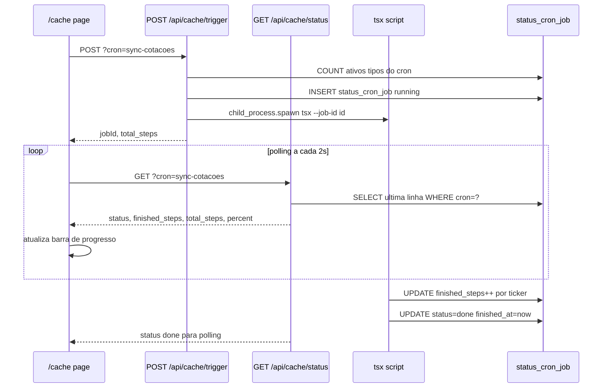

# Especificação: Página "Cache Conteúdo"

## Objetivo

Página `/cache` (menu: "Cache Conteúdo") que permite disparar manualmente os CRONs existentes em `scripts/`
e acompanhar o progresso em tempo real via barra de status, usando a tabela `status_cron_job` no Supabase.

---

## CRONs disponíveis

| Script                        | npm script          | Tipos de ativo  | Unidade de progresso      |
|-------------------------------|---------------------|-----------------|---------------------------|
| `scripts/sync-cotacoes.ts`    | `sync-cotacoes`     | `acao`, `fii`   | 1 ticker por chamada      |
| `scripts/sync-cotacoes-us.ts` | `sync-cotacoes-us`  | `stock`, `reit` | 1 ticker (lotes de 5)     |

---

## Tabela de controle: `status_cron_job`

Criada via [`db/supabase/create_table_status_cron_job.sql`](../../db/supabase/create_table_status_cron_job.sql).

| Campo           | Tipo         | Regras                                          |
|-----------------|--------------|-------------------------------------------------|
| `id`            | BIGINT       | auto-incremento, PRIMARY KEY                    |
| `cron`          | VARCHAR(100) | NOT NULL — ex: `sync-cotacoes`                  |
| `status`        | VARCHAR(20)  | NOT NULL DEFAULT `running` — `running|done|error` |
| `total_steps`   | INT          | NOT NULL DEFAULT 0 — total de tickers do job    |
| `finished_steps`| INT          | NOT NULL DEFAULT 0 — tickers já processados     |
| `started_at`    | TIMESTAMPTZ  | NOT NULL DEFAULT now()                          |
| `finished_at`   | TIMESTAMPTZ  | NULL até job concluir                           |
| `created_at`    | TIMESTAMPTZ  | NOT NULL DEFAULT now()                          |

---

## Fluxo geral



---

## Estrutura de arquivos

```
db/
  supabase/
    create_table_status_cron_job.sql    ← script SQL de criação da tabela
scripts/
  job-progress.ts                       ← helpers: parseJobId, updateJobProgress, finishJob
  sync-cotacoes.ts                      ← modificado: aceita --job-id
  sync-cotacoes-us.ts                   ← modificado: aceita --job-id
src/
  types/
    cron-job.ts                         ← CronJobRow, CronJobStatusResponse
  app/
    api/
      cache/
        trigger/route.ts                ← POST: inicia cron
        status/route.ts                 ← GET: lê progresso
    cache/
      page.tsx                          ← página com cards e barra de progresso
  components/
    Navbar.tsx                          ← adicionado link "Cache Conteúdo"
```

---

## API Routes

### `POST /api/cache/trigger?cron=<nome>`

1. Valida `cron` — aceita apenas `sync-cotacoes` ou `sync-cotacoes-us`
2. Verifica se já existe job `running` para o mesmo cron → retorna `409` se sim
3. Conta `total_steps` em `ativos`:
   - `sync-cotacoes`: `WHERE type IN ('acao','fii')`
   - `sync-cotacoes-us`: `WHERE type IN ('stock','reit')`
4. Insere linha em `status_cron_job` com `status='running'` e obtém o `id`
5. Chama `child_process.spawn('npx', ['tsx', 'scripts/<cron>.ts', '--job-id', String(id)])` — non-blocking
6. Retorna `{ jobId: id, total_steps }`

### `GET /api/cache/status?cron=<nome>`

1. `SELECT * FROM status_cron_job WHERE cron = ? ORDER BY started_at DESC LIMIT 1`
2. Calcula `percent = Math.round(finished_steps / total_steps * 100)` (0 se `total_steps = 0`)
3. Retorna `{ id, status, total_steps, finished_steps, percent, started_at, finished_at }`

---

## Modificação nos scripts

Arquivo auxiliar `scripts/job-progress.ts` com três funções:

```typescript
// Extrai o valor de --job-id de process.argv
export function parseJobId(): number | null

// UPDATE finished_steps = ok + fail WHERE id = jobId
export async function updateJobProgress(supabase, jobId, ok, fail): Promise<void>

// UPDATE status = done|error, finished_at = now() WHERE id = jobId
export async function finishJob(supabase, jobId, status): Promise<void>
```

Cada script:
- Chama `parseJobId()` no início; se `null`, continua sem atualizar o banco (compatibilidade com execução direta via CLI)
- Após cada ticker (ok ou fail): `await updateJobProgress(supabase, jobId, ok, fail)`
- Ao final do `main()`: `await finishJob(supabase, jobId, fail > 0 ? 'error' : 'done')`
- `sync-cotacoes-us`: incrementa por **ticker individual** (não por lote) para granularidade da barra

---

## Página `/cache`

### Layout — um card por CRON

```
┌──────────────────────────────────────────────┐
│ Sync Cotações BR                             │
│ Ativos: acao, fii  (via Brapi)               │
│ Último: 10/04/2025 14:32 — Concluído         │
│                                              │
│  [████████░░░░░░░░] 52%  26 de 50 tickers   │
│                                              │
│  [ Executar ]                                │
└──────────────────────────────────────────────┘
```

### Comportamento

- Ao montar: `GET /api/cache/status` para cada cron (exibe estado do último job)
- Botão "Executar" desabilitado e rotulado "Executando..." quando `status === 'running'`
- Polling a cada **2s** apenas enquanto `status === 'running'`; para ao atingir `done` ou `error`
- Ao concluir: exibe tempo total (`finished_at - started_at`) formatado em segundos
- Se `started_at` > 15 min atrás e ainda `running`: exibe alerta "Job travado — pode ter falhado"

---

## Notas de implementação

- `child_process.spawn` é non-blocking: o API Route retorna imediatamente; o script roda em background
- Para `sync-cotacoes-us`, cada ticker individual (não o lote) conta como 1 step para barra granular
- A atualização de `finished_steps` usa UPDATE simples (sem RPC atômica) — adequado para uso pessoal com execução sequencial
- Em Vercel Functions o timeout máximo pode ser atingido para listas grandes; adequado para uso local/pessoal
