# Plano: Cadastro e Listagem de Aportes

## Stack

- Mesma do projeto: Next.js 16 App Router + TypeScript + Tailwind CSS + Supabase
- Tabela `aportes` já criada via `db/supabase/create_table_aportes.sql`

## Schema da Tabela `aportes`

```sql
CREATE TABLE IF NOT EXISTS aportes (
    id             BIGINT GENERATED ALWAYS AS IDENTITY PRIMARY KEY,
    code           VARCHAR(20)    NOT NULL,
    qtd            NUMERIC(15, 6) NOT NULL,
    value_total    NUMERIC(15, 6) NOT NULL,
    date_operation DATE           NOT NULL,
    CONSTRAINT aportes_unique_code_qtd_date_operation UNIQUE (code, qtd, date_operation)
);
```

Índices: `idx_aportes_code` e `idx_aportes_date_operation`.

## Estrutura de Arquivos a Criar

```
src/
├── types/
│   └── aporte.ts                          ← interfaces Aporte, AporteFilters
├── app/
│   ├── cadastro-aportes/
│   │   └── page.tsx                       ← tela de cadastro em lote
│   ├── listagem-aportes/
│   │   └── page.tsx                       ← tela de listagem com filtros, paginação, edição/exclusão
│   └── api/
│       └── aportes/
│           ├── route.ts                   ← GET (listagem filtrada) + POST (cadastro em lote)
│           ├── check/
│           │   └── route.ts              ← POST (verificação de duplicatas antes do preview)
│           └── [id]/
│               └── route.ts              ← PUT (edição) + DELETE (exclusão)
└── components/
    └── Navbar.tsx                         ← adicionar 2 novos links
```

## Endpoints da API

- `POST /api/aportes` — cadastro em lote; retorna `{ inserted, duplicates }`
- `POST /api/aportes/check` — verifica quais aportes já existem no banco; retorna `{ duplicates }`
- `GET /api/aportes` — listagem com parâmetros:
    - `type` — filtra por tipo via `ativos.code IN (...)`; omitir ou `todos` para sem filtro
    - `code` — filtra por código (parcial ou exato)
    - `date_start` / `date_end` — intervalo; default: hoje−30 dias até hoje
    - `sort_by` — `code` ou `date_operation`; default: `date_operation`
    - `sort_dir` — `asc` ou `desc`; default: `desc`
    - `page` — página atual; default: `1`
    - `per_page` — itens por página: `10`, `20`, `50`, `100`; default: `20`
    - Retorna `{ aportes, total }`
- `PUT /api/aportes/[id]` — edita `qtd`, `value_total`, `date_operation`
- `DELETE /api/aportes/[id]` — exclui

## Fluxo: Cadastro em Lote

```mermaid
flowchart LR
    Input[Textarea] --> ParseBtn["Clicar 'Cadastrar'"]
    ParseBtn --> ParseLocal[Parse local + validações]
    ParseLocal --> CheckAPI["POST /api/aportes/check (verificar duplicatas banco)"]
    CheckAPI --> Preview["Preview: novo / duplicata lote / duplicata banco"]
    Preview --> Confirm["Clicar 'Confirmar'"]
    Confirm --> PostAPI["POST /api/aportes"]
    PostAPI --> Result["Resumo: X cadastrados, Y duplicatas, Z ignoradas"]
```



### Parser (client-side)

- Separador: `;` — 4 colunas obrigatórias: `code;qtd;value_total;date_operation`
- TRIM em todos os campos; `code` salvo em maiúsculo
- Aceitar `,` e `.` como separador decimal em `qtd` e `value_total`
- Ignorar linhas em branco ou que começam com `#`
- Ignorar linhas com número de colunas diferente de 4
- Ignorar linhas com campos inválidos (não numérico, data inválida, etc.)
- Formatos de data aceitos: `dd/mm/yyyy` e `yyyy-mm-dd` → normalizar para `yyyy-mm-dd`
- Duplicatas no lote: detectadas localmente por chave `code|qtd|date_operation`
- Duplicatas no banco: verificadas via `POST /api/aportes/check` antes de exibir o preview

### Preview

Tabela com colunas: Código, Quantidade, Valor Total, Data, Status (`Novo` / `Duplicata lote` / `Duplicata banco`)

## Fluxo: Listagem de Aportes

- Carrega automaticamente com filtros padrão (últimos 30 dias, todos os tipos)
- Filtro por tipo usa `SELECT code FROM ativos WHERE type = ?` para montar `IN (...)`
- Paginação server-side via parâmetros `page` e `per_page`
- Tipo do ativo exibido via mapa `code → type` obtido de `GET /api/assets` (carregado uma vez no mount)

### Colunas da Tabela

| Coluna           | Fonte                    | Formato                                    |
| ---------------- | ------------------------ | ------------------------------------------ |
| Tipo do Ativo    | `ativos.type` via map    | `TYPES_ASSETS[type]` ou `—` se não mapeado |
| Código           | `aportes.code`           | string                                     |
| Quantidade       | `aportes.qtd`            | inteiro se sem decimal, 4 casas se decimal |
| Valor Total      | `aportes.value_total`    | 2 casas decimais                           |
| Valor Unitário   | `value_total / qtd`      | 2 casas decimais; exibir `0,00` se `qtd = 0` |
| Data da Operação | `aportes.date_operation` | `dd/mm/yyyy`                               |
| Ações            | —                        | Editar / Excluir                           |

### Modal Editar

- Campos editáveis: `qtd`, `value_total`, `date_operation` (`input type="date"`)
- Após salvar: refetch da lista (para recalcular valor unitário e total)

### Modal Excluir

- Exibe código e data: "Deseja excluir o aporte **PETR4** de **dd/mm/yyyy**?"
- Após excluir: refetch da lista (para atualizar o total de aportes)

## Atualização do Navbar

Adicionar em `src/components/Navbar.tsx` dois novos links:

- `Cadastro Aportes` → `/cadastro-aportes`
- `Listagem de Aportes` → `/listagem-aportes`

## Pontos Tratados na Implementação

- **PUT + UNIQUE violation:** ao editar `qtd` ou `date_operation`, a nova combinação `(code, qtd, date_operation)` pode violar a constraint. O handler PUT captura o erro Postgres `23505` e retorna mensagem amigável.
- **Filtro tipo com lista vazia:** se nenhum ativo do tipo existe em `ativos`, a cláusula `IN ()` é inválida no PostgreSQL. A API retorna lista vazia imediatamente sem executar a query.
- **`qtd = 0`:** o schema permite; a UI exibirá `0,00` no Valor Unitário. O parser não rejeita `qtd = 0` (pode ser um registro de ajuste/estorno).
- **Check endpoint separado:** `POST /api/aportes/check` verifica duplicatas antes do preview, evitando a necessidade de buscar todos os aportes do banco. Rotas estáticas têm precedência sobre dinâmicas em Next.js App Router.
