# Plano: Cadastro e Listagem de Aportes

## Stack

- Mesma do projeto: Next.js 16 App Router + TypeScript + Tailwind CSS + Supabase
- Tabela `aportes` criada/atualizada via [`db/supabase/create_table_aportes.sql`](../../db/supabase/create_table_aportes.sql)

## Schema da Tabela `aportes`

```sql
CREATE TABLE IF NOT EXISTS aportes (
    id              BIGINT GENERATED ALWAYS AS IDENTITY PRIMARY KEY,
    code            VARCHAR(20)    NOT NULL,
    qtd             NUMERIC(15, 6) NOT NULL,
    value_total     NUMERIC(15, 6) NOT NULL,
    date_operation  DATE           NOT NULL,
    currency        VARCHAR(3)     NOT NULL DEFAULT 'BRL',
    dolar_value     NUMERIC(15, 6) NOT NULL DEFAULT 0.0,
    info            VARCHAR(100)   NOT NULL DEFAULT '',
    CONSTRAINT aportes_unique_code_qtd_date_operation UNIQUE (code, qtd, date_operation)
);
```

Índices: `idx_aportes_code` e `idx_aportes_date_operation`. RLS desabilitado no script (projeto pessoal).

## Constantes (`src/lib/constants.ts`)

- `TYPES_ASSETS` — tipos de ativo para filtros e rótulos na listagem
- `CURRENCIES` — moedas suportadas na UI e na normalização: `BRL`, `USD`

## Estrutura de Arquivos

```
src/
├── types/
│   └── aporte.ts                          ← interfaces Aporte, AporteFilters
├── lib/
│   └── constants.ts                     ← TYPES_ASSETS, CURRENCIES
├── app/
│   ├── cadastro-aportes/
│   │   └── page.tsx                       ← tela de cadastro em lote
│   ├── listagem-aportes/
│   │   └── page.tsx                       ← listagem, filtros, paginação, edição/exclusão
│   └── api/
│       └── aportes/
│           ├── route.ts                   ← GET (listagem filtrada) + POST (cadastro em lote)
│           ├── check/
│           │   └── route.ts              ← POST (verificação de duplicatas antes do preview)
│           └── [id]/
│               └── route.ts              ← PUT (edição) + DELETE (exclusão)
└── components/
    └── Navbar.tsx                         ← links Cadastro / Listagem de Aportes
```

## Endpoints da API

- `POST /api/aportes` — cadastro em lote; retorna `{ inserted, duplicates }`
- `POST /api/aportes/check` — verifica quais aportes já existem no banco; retorna `{ duplicates }`
- `GET /api/aportes` — listagem com parâmetros:
    - `type` — filtra por tipo via `ativos.code IN (...)`; omitir ou `todos` para sem filtro
    - `code` — filtra por código (parcial ou exato)
    - `date_start` / `date_end` — intervalo; default: hoje−30 dias até hoje
    - `currency` — `todos` (default implícito no client) ou `BRL` / `USD`; se não for `todos`, filtra por `aportes.currency`
    - `info` — texto; se preenchido, filtra com `ILIKE %valor%` em `aportes.info`
    - `sort_by` — `code` ou `date_operation`; default: `date_operation`
    - `sort_dir` — `asc` ou `desc`; default: `desc`
    - `page` — página atual; default: `1`
    - `per_page` — itens por página: `10`, `20`, `50`, `100`; default: `20`
    - Retorna `{ aportes, total }`
- `PUT /api/aportes/[id]` — edita `qtd`, `value_total`, `date_operation`, `currency`, `dolar_value`, `info` (normalização no servidor; ver abaixo)
- `DELETE /api/aportes/[id]` — exclui

### Normalização (POST e PUT)

Funções compartilhadas na API:

- **currency:** trim + maiúsculo; se não for `USD` nem `BRL`, grava `BRL`
- **dolar_value:** parse numérico (aceita vírgula); se inválido, `0.0`
- **info:** string trim; vazio permitido

## Fluxo: Cadastro em Lote

```mermaid
flowchart LR
    Input[Textarea] --> ParseBtn["Clicar 'Cadastrar'"]
    ParseBtn --> ParseLocal[Parse local + validações]
    ParseLocal --> CheckAPI["POST /api/aportes/check (verificar duplicatas banco)"]
    CheckAPI --> Preview["Preview: novo / duplicata lote / duplicata banco"]
    Preview --> Confirm["Clicar 'Confirmar'"]
    Confirm --> PostAPI["POST /api/aportes"]
    PostAPI --> Result["Resumo: X cadastrados, Y duplicatas, Z ignoradas"]
```



### Parser (client-side)

- Separador: `;` — **4 a 7 colunas:** `code;qtd;value_total;date_operation[;currency[;dolar_value[;info]]]`
- Colunas 5–7 opcionais; ausentes são tratadas como vazio → no servidor viram `BRL`, `0.0`, `""` conforme regras
- TRIM em todos os campos; `code` salvo em maiúsculo
- Aceitar `,` e `.` como separador decimal em `qtd` e `value_total` (e em `dolar_value` quando presente)
- Ignorar linhas em branco ou que começam com `#`
- Ignorar linhas com menos de 4 ou mais de 7 colunas
- Ignorar linhas com campos obrigatórios inválidos (não numérico, data inválida, etc.)
- Formatos de data aceitos: `dd/mm/yyyy` e `yyyy-mm-dd` → normalizar para `yyyy-mm-dd`
- **currency no parser:** vazio ou inválido → `BRL`; apenas `USD` e `BRL` são aceitos como válidos
- **dolar_value no parser:** vazio ou não numérico → `0.0`
- Duplicatas no lote: detectadas localmente por chave `code|qtd|date_operation`
- Duplicatas no banco: verificadas via `POST /api/aportes/check` antes de exibir o preview

### Preview

Tabela com colunas: Código, Quantidade, Valor Total, Data, **Moeda**, **Dólar**, **Info**, Status (`Novo` / `Duplicata lote` / `Duplicata banco`)

## Fluxo: Listagem de Aportes

- Carrega automaticamente com filtros padrão (últimos 30 dias, todos os tipos, **todos** nas moedas, informação vazia)
- Filtro por tipo usa `SELECT code FROM ativos WHERE type = ?` para montar `IN (...)`
- Paginação server-side via parâmetros `page` e `per_page`
- Tipo do ativo exibido via mapa `code → type` obtido de `GET /api/assets` (carregado uma vez no mount). **Não há inner join na query de aportes**; o join é lógico no client pelo mapa de ativos (equivalente funcional ao requisito “tipo pelo código”).

### Filtros adicionais

| Filtro       | UI                         | Comportamento                                      |
| ------------ | -------------------------- | -------------------------------------------------- |
| Moeda        | select: Todos, BRL, USD    | `todos` = sem filtro; caso contrário `.eq(currency)` |
| Informação   | input text                 | se preenchido, `ILIKE %texto%` em `info`           |

### Colunas da Tabela (ordem)

| Coluna                 | Fonte / regra                                                                 | Formato / observação                                      |
| ---------------------- | ----------------------------------------------------------------------------- | --------------------------------------------------------- |
| Data da Operação       | `aportes.date_operation`                                                      | `dd/mm/yyyy`                                              |
| Tipo do Ativo          | `ativos.type` via mapa `code`                                                 | `TYPES_ASSETS[type]` ou `—`                               |
| Código                 | `aportes.code`                                                                | string                                                    |
| Quantidade             | `aportes.qtd`                                                                 | inteiro se sem decimal, 4 casas se decimal                |
| Moeda                  | `aportes.currency`                                                            | `BRL` / `USD`                                             |
| Valor Total            | `aportes.value_total`                                                         | 2 decimais + prefixo `R$` ou `US$` conforme moeda         |
| Valor Unitário         | `value_total / qtd`                                                           | 2 decimais + mesmo prefixo; se `qtd = 0`, exibe valor 0 com símbolo |
| Dólar no dia           | `aportes.dolar_value`                                                         | só se `currency === USD` e `dolar_value > 0`: `R$` + valor; senão vazio / `—` |
| Informação             | `aportes.info`                                                                | string; `—` se vazio                                     |
| Ações                  | —                                                                             | Editar / Excluir                                          |

### Modal Editar

- Campos editáveis: `qtd`, `value_total`, `date_operation`, `currency` (select com `CURRENCIES`), `dolar_value`, `info`
- Após salvar: refetch da lista (valor unitário e totais atualizados)

### Modal Excluir

- Exibe código e data: "Deseja excluir o aporte **PETR4** de **dd/mm/yyyy**?"
- Após excluir: refetch da lista (para atualizar o total de aportes)

## Atualização do Navbar

Adicionar em `src/components/Navbar.tsx` dois links:

- `Cadastro Aportes` → `/cadastro-aportes`
- `Listagem de Aportes` → `/listagem-aportes`

## Pontos Tratados na Implementação

- **PUT + UNIQUE violation:** ao editar `qtd` ou `date_operation`, a nova combinação `(code, qtd, date_operation)` pode violar a constraint. O handler PUT captura o erro Postgres `23505` e retorna mensagem amigável.
- **Filtro tipo com lista vazia:** se nenhum ativo do tipo existe em `ativos`, a API retorna lista vazia imediatamente sem executar a query com `IN ()` inválido.
- **`qtd = 0`:** o schema permite; a UI exibe valor unitário com símbolo da moeda e valor numérico zero. O parser não rejeita `qtd = 0`.
- **Check endpoint separado:** `POST /api/aportes/check` verifica duplicatas antes do preview. Rotas estáticas têm precedência sobre dinâmicas no App Router.
- **Campos novos em linhas antigas no banco:** após rodar os `ALTER TABLE` no Supabase, registros existentes recebem defaults (`BRL`, `0.0`, `''`).
