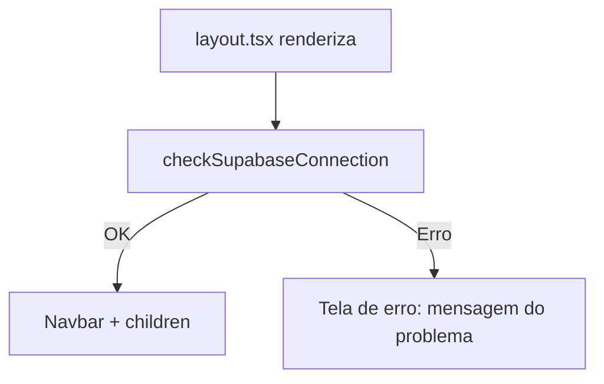

# Plano: Cadastro e Consulta de Ativos

## Stack Adicionada

- **Banco de dados:** Supabase (PostgreSQL)
- **Cliente:** `@supabase/supabase-js`
- **Variáveis de ambiente (server-only, sem `NEXT_PUBLIC_`):**
  - `SUPABASE_URL`
  - `SUPABASE_PUBLISHABLE_DEFAULT_KEY`

## Estrutura de Arquivos

```
ibov/
├── db/
│   └── supabase/
│       └── create_table_ativos.sql    ← executar manualmente no Supabase
├── src/
│   ├── lib/
│   │   ├── constants.ts               ← URL_API_BRAPI, TYPES_ASSETS
│   │   └── supabase.ts                ← client + checkSupabaseConnection()
│   ├── types/
│   │   └── asset.ts                   ← interfaces Asset, AssetWithPercent
│   ├── components/
│   │   └── Navbar.tsx                 ← menu de navegação (client component)
│   └── app/
│       ├── layout.tsx                 ← health check DB + Navbar
│       ├── page.tsx                   ← cotação (atualizado)
│       ├── cadastro-ativos/
│       │   └── page.tsx               ← cadastro em lote
│       ├── listagem-ativos/
│       │   └── page.tsx               ← listagem com edição/exclusão
│       └── api/
│           └── assets/
│               ├── route.ts           ← GET + POST
│               └── [id]/
│                   └── route.ts       ← PUT + DELETE
```

## Schema da Tabela `ativos`

```sql
CREATE TABLE IF NOT EXISTS ativos (
    id     BIGINT GENERATED ALWAYS AS IDENTITY PRIMARY KEY,
    code   VARCHAR(20)    NOT NULL,
    info   VARCHAR(255)   NOT NULL,
    type   VARCHAR(20)    NOT NULL,
    weight NUMERIC(10, 2) NOT NULL DEFAULT 0,
    CONSTRAINT ativos_code_unique UNIQUE (code)
);
CREATE INDEX IF NOT EXISTS idx_ativos_code ON ativos (code);
ALTER TABLE ativos DISABLE ROW LEVEL SECURITY;
```

## Endpoints da API

| Método | Rota | Descrição |
|---|---|---|
| `GET` | `/api/assets` | Retorna todos os ativos (sem filtro de tipo) |
| `GET` | `/api/assets?type=acao` | Retorna ativos filtrados por tipo |
| `POST` | `/api/assets` | Cadastro em lote — retorna `{ inserted, duplicates }` |
| `PUT` | `/api/assets/[id]` | Edita `info` e `weight` de um ativo |
| `DELETE` | `/api/assets/[id]` | Exclui um ativo |

## Health Check (parar o projeto)

O `layout.tsx` (Server Component) chama `checkSupabaseConnection()` antes de renderizar.
Se a conexão ou a tabela não existir, renderiza uma tela de erro em vez do layout normal — efetivamente parando o projeto para o usuário.



## Fluxo: Cadastro em Lote

```mermaid
flowchart LR
    Input[Textarea] --> ParseBtn["Clicar 'Cadastrar'"]
    ParseBtn --> ParseLocal[Parse local + validações]
    ParseLocal --> FetchCodes["GET /api/assets (buscar códigos existentes)"]
    FetchCodes --> Preview["Preview: novo / duplicata lote / duplicata banco"]
    Preview --> Confirm["Clicar 'Confirmar'"]
    Confirm --> PostAPI["POST /api/assets"]
    PostAPI --> Result["Resumo: X cadastrados, Y duplicatas, Z ignoradas"]
```



## Fluxo: Listagem de Ativos

- Carrega automaticamente com `type=acao`
- Filtro por tipo dispara `GET /api/assets?type=...`
- Peso % = `weight / totalWeight * 100` (exibe `0%` se totalWeight = 0)
- Modal Editar: campos `info` e `weight` (PUT)
- Modal Excluir: exibe código do ativo + confirmação (DELETE)
- Após editar/excluir: refetch da lista para recalcular Peso %

## Navegação

| Link | Rota |
|---|---|
| Cotação IBOV | `/` |
| Cadastro em Lote de Ativos | `/cadastro-ativos` |
| Listagem de Ativos | `/listagem-ativos` |
