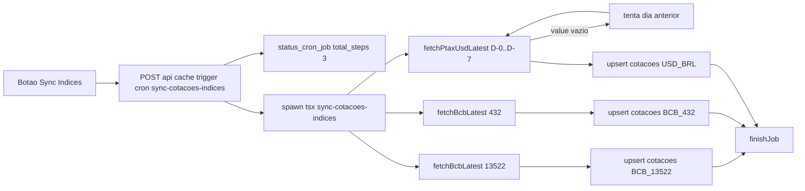

# Adicionar cotação do dólar (PTAX) ao cron de índices

## Contexto

O cron `sync-cotacoes-indices` hoje grava 2 índices (`BCB_13522` IPCA, `BCB_432` SELIC) via SGS (`api.bcb.gov.br`). Vamos adicionar um terceiro registro com a **cotação de compra do dólar PTAX** lendo o endpoint Olinda:

```
https://olinda.bcb.gov.br/olinda/servico/PTAX/versao/v1/odata/CotacaoDolarDia(dataCotacao=@dataCotacao)?@dataCotacao=%27MM-DD-YYYY%27&$top=1&$format=json
```

Resposta usada (campo `cotacaoCompra` do primeiro item de `value`):

```json
{ "value": [{ "cotacaoCompra": 5.0295, "cotacaoVenda": 5.0301, "dataHoraCotacao": "2026-05-20 13:05:27.747" }] }
```

Decisões já tomadas:

- `code` na tabela `cotacoes`: `USD_BRL` (par cambial, sem prefixo `BCB_`).
- Fallback: se `value` vier vazio (fim de semana/feriado), tentar D-1, D-2, D-3... até encontrar a última cotação disponível (limite de segurança de 7 dias).
- `maturity_date` permanece `NULL` (igual aos demais índices).
- Upsert com `onConflict: 'code'` na tabela `cotacoes` (já tem `UNIQUE(code)`).

## Arquivos afetados

### 1. `src/lib/bcb-service.ts` — adicionar `fetchPtaxUsdLatest`

Novo helper isolado (segue o estilo dos demais `fetch*` do arquivo: `fetch` nativo, validação de body, retorno padronizado em `BcbQuote`). Ponto-chave: a data na URL Olinda usa formato `MM-DD-YYYY` (americano) entre aspas simples URL-encodadas (`%27...%27`).

```typescript
const PTAX_BASE_URL = 'https://olinda.bcb.gov.br/olinda/servico/PTAX/versao/v1/odata';

interface PtaxRow {
    cotacaoCompra: number;
    cotacaoVenda: number;
    dataHoraCotacao: string; // "yyyy-MM-dd HH:mm:ss.SSS"
}
interface PtaxResponse {
    value?: PtaxRow[];
}

function formatPtaxDate(d: Date): string {
    /* MM-DD-YYYY */
}

export async function fetchPtaxUsdLatest(maxDaysBack = 7): Promise<BcbQuote> {
    const today = new Date();
    for (let i = 0; i <= maxDaysBack; i++) {
        const target = new Date(today);
        target.setDate(today.getDate() - i);
        const url =
            `${PTAX_BASE_URL}/CotacaoDolarDia(dataCotacao=@dataCotacao)` +
            `?@dataCotacao=%27${formatPtaxDate(target)}%27&$top=1&$format=json`;
        const res = await fetch(url);
        if (!res.ok) continue;
        const body = (await res.json()) as PtaxResponse;
        const row = body.value?.[0];
        if (!row) continue;
        const value = Number(row.cotacaoCompra);
        if (!Number.isFinite(value)) continue;
        const date_update = row.dataHoraCotacao.split(' ')[0];
        if (!date_update) continue;
        return { value, date_update };
    }
    throw new Error(`[BcbService] PTAX sem cotacao nos ultimos ${maxDaysBack} dias.`);
}
```

### 2. `scripts/sync-cotacoes-indices.ts` — generalizar `IndiceTarget`

Hoje cada target tinha `serie: number` e a chamada era fixa em `fetchBcbLatest(target.serie)`. Trocamos por um `fetch` por target — assim PTAX (sem série SGS) entra no mesmo loop sem casos especiais.

```typescript
import { BCB_SERIES, fetchBcbLatest, fetchPtaxUsdLatest } from '../src/lib/bcb-service';
import type { BcbQuote } from '../src/lib/bcb-service';

interface IndiceTarget {
    code: string;
    label: string;
    fetch: () => Promise<BcbQuote>;
}

const TARGETS: IndiceTarget[] = [
    { code: `BCB_${BCB_SERIES.IPCA_12M}`, label: 'IPCA 12M', fetch: () => fetchBcbLatest(BCB_SERIES.IPCA_12M) },
    { code: `BCB_${BCB_SERIES.SELIC_META}`, label: 'SELIC Meta', fetch: () => fetchBcbLatest(BCB_SERIES.SELIC_META) },
    { code: 'USD_BRL', label: 'Dolar PTAX', fetch: () => fetchPtaxUsdLatest() },
];

// no loop:
const quote = await target.fetch();
```

Resto do script (upsert em `cotacoes`, `parseJobId`/`updateJobProgress`/`finishJob`, logs `[code] OK — valor (data) [label]`, `process.exit`) **não muda**.

### 3. `src/app/api/cache/trigger/route.ts` — bump de `fixedTotalSteps`

Único ponto de mudança: `fixedTotalSteps: 2` → `fixedTotalSteps: 3` na entrada `sync-cotacoes-indices` do `CRON_CONFIG`.

```typescript
'sync-cotacoes-indices': {
    script: 'scripts/sync-cotacoes-indices.ts',
    fixedTotalSteps: 3,
},
```

### 4. `src/app/cache/page.tsx` — atualizar texto do card

Card existente em `CRON_CARDS`. Apenas trocar `label` e `description` para refletir o novo escopo:

```typescript
{
    cron: 'sync-cotacoes-indices',
    label: 'Sync Cotações Índices (IPCA, SELIC, Dólar)',
    description: 'Sincroniza IPCA 12M, SELIC meta e cotação PTAX do dólar (compra) via APIs do Banco Central.',
    types: ['indice'],
    source: 'BCB (api.bcb.gov.br + olinda.bcb.gov.br)',
},
```

A barra de progresso (`finished_steps / total_steps`) já é dinâmica — exibe 0/3 → 3/3 sem mudanças no componente.

## Não afeta

- DDL de `cotacoes` (PTAX entra como linha comum, só com `code` novo).
- Tipos compartilhados em `src/types/cotacao.ts` (`CotacaoUpsertInput` já cobre o shape).
- `src/app/api/indices/route.ts` continua devolvendo só IPCA/SELIC (expor o dólar via API é tarefa separada — não pedida).
- Listagens de `ativos` (PTAX não é ativo, só linha em `cotacoes`).

## Fluxo


