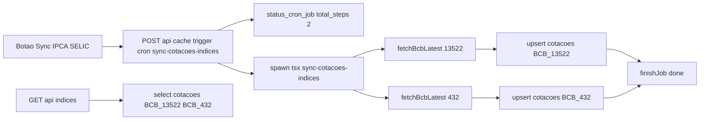

## Convenções decididas

- `code` na tabela `cotacoes`: `BCB_13522` (IPCA 12 meses) e `BCB_432` (SELIC meta).
- Rota `GET /api/indices`: lê de `cotacoes` (cache populado pelo cron).
- `maturity_date` permanece `NULL` para esses registros.
- A tabela `cotacoes` já tem `UNIQUE (code)` — upsert com `onConflict: 'code'` (mesmo padrão do TD).

## 1. `src/lib/bcb-service.ts` (novo)

Espelha o estilo de `[tesouro-direto-service.ts](src/lib/tesouro-direto-service.ts)` — fetch nativo, sem token, validação de body e helper para converter `dd/MM/yyyy` em `yyyy-MM-dd`.

```typescript
const BASE_URL = 'https://api.bcb.gov.br/dados/serie/bcdata.sgs';

export interface BcbQuote {
    value: number;
    date_update: string; // yyyy-mm-dd
}

export const BCB_SERIES = {
    IPCA_12M: 13522,
    SELIC_META: 432,
} as const;

// "01/03/2026" -> "2026-03-01"
function parseBrDate(br: string): string {
    /* ... */
}

export async function fetchBcbLatest(serie: number): Promise<BcbQuote> {
    const url = `${BASE_URL}.${serie}/dados/ultimos/1?formato=json`;
    // fetch + valida [{data, valor}] + converte
}
```

## 2. `scripts/sync-cotacoes-indices.ts` (novo)

Mesmo esqueleto de `[sync-cotacoes-td.ts](scripts/sync-cotacoes-td.ts)`, mas iterando sobre uma lista fixa de duas séries (não consulta `ativos`):

- `total = 2`, integra `parseJobId` / `updateJobProgress` / `finishJob`.
- Para cada `{ code: 'BCB_13522', serie: 13522 }` e `{ code: 'BCB_432', serie: 432 }`:
  - `fetchBcbLatest(serie)` → `{ value, date_update }`.
  - Upsert em `cotacoes` com `onConflict: 'code'`, `maturity_date: null`.
- Logs `[BCB_xxx] OK — valor (data)`.

## 3. `package.json`

Adicionar script:

```json
"sync-cotacoes-indices": "tsx scripts/sync-cotacoes-indices.ts"
```

## 4. `src/app/api/cache/trigger/route.ts`

Registrar o novo cron. O job não tem ativos, então o cálculo de `total_steps` precisa ser ajustado:

- Adicionar `'sync-cotacoes-indices'` ao tipo `CronName`.
- Mudar `CRON_CONFIG` para que cada entrada tenha `script` + `types?: string[]` + `fixedTotalSteps?: number`.
- Para `sync-cotacoes-indices`: `{ script: 'scripts/sync-cotacoes-indices.ts', fixedTotalSteps: 2 }`.
- No bloco que calcula `total_steps`: se `config.fixedTotalSteps` estiver definido, usá-lo direto e pular o `count` em `ativos`; senão manter a lógica atual com `config.types`.

## 5. `src/app/api/indices/route.ts` (novo)

`GET` que lê os 2 registros do `cotacoes` e devolve um shape estável:

```typescript
import { NextResponse } from 'next/server';
import { getSupabaseServer } from '@/lib/supabase';

const CODES = ['BCB_13522', 'BCB_432'] as const;

export async function GET() {
    const supabase = getSupabaseServer();
    const { data, error } = await supabase.from('cotacoes').select('code, value, date_update').in('code', CODES);
    // ...
    return NextResponse.json({
        ipca: data.find(d => d.code === 'BCB_13522') ?? null,
        selic: data.find(d => d.code === 'BCB_432') ?? null,
    });
}
```

Erro padrão `{ error: string }` conforme [api-routes.mdc](.cursor/rules/api-routes.mdc).

## 6. `src/app/cache/page.tsx`

Adicionar card no array `CRON_CARDS` (mantém o padrão dos demais — botão "Executar", polling de status, barra de progresso 0/2 → 2/2):

```typescript
{
  cron: "sync-cotacoes-indices",
  label: "Sync Cotações Índices IPCA e SELIC",
  description: "Sincroniza IPCA (acumulado 12 meses) e SELIC meta via API do Banco Central.",
  types: ["indice"],
  source: "BCB (api.bcb.gov.br)",
}
```

Nenhuma mudança no `CronCardComponent` — a UI atual já funciona com qualquer cron registrado no trigger/status.

## Observações

- Não cria/altera DDL: os 2 índices entram como linhas comuns em `cotacoes` (apenas `code` diferente do padrão de tickers).
- Listagens de `ativos` continuam ignorando esses códigos — eles existem só na tabela de cotações.
- Sem alteração em tipos compartilhados; `CotacaoUpsertInput` já cobre o shape necessário.

## Fluxo




