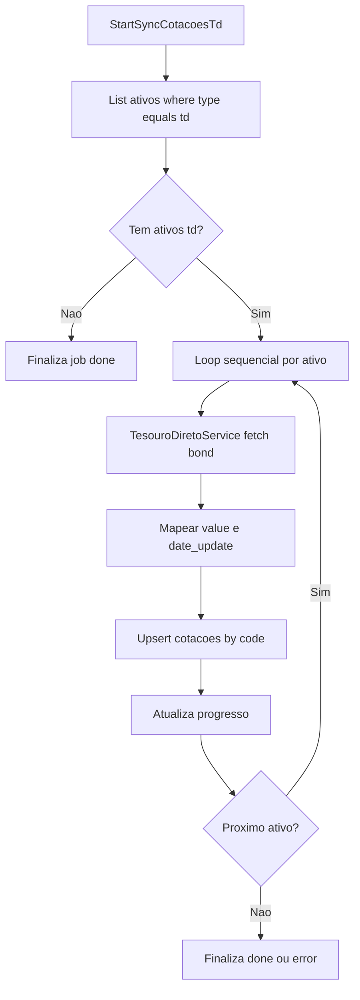

# Especificação: job `sync-cotacoes-td` — Tesouro Direto

Fonte: [`.vscode/tesouro.js`](../../../.vscode/tesouro.js) (script original Google Sheets, convertido para TypeScript).

## Objetivo

Persistir a cotação mais recente dos títulos do Tesouro Direto na tabela `cotacoes` do Supabase, disparada manualmente via CLI ou pelo painel de cache.

---

## 1. Tabela `cotacoes` (schema existente)

A tabela já existe e é compartilhada com `sync-cotacoes` e `sync-cotacoes-us`. Nenhuma mudança de schema é necessária para esta job.

| Campo         | Tipo            | Regras                                                |
| ------------- | --------------- | ----------------------------------------------------- |
| `id`          | `BIGINT`        | `GENERATED ALWAYS AS IDENTITY`, `PRIMARY KEY`         |
| `code`        | `VARCHAR(20)`   | `NOT NULL`, `UNIQUE` — um registro por título/code    |
| `date_update` | `DATE`          | `NOT NULL` — data local da consulta (API sem retorno de data) |
| `value`       | `NUMERIC(15,6)` | `NOT NULL` — `unitaryRedemptionValue` por padrão      |

---

## 2. API externa — Radar Opções

- **Endpoint:** `https://api.radaropcoes.com/bonds/{bondName}`
- **Método:** `GET`
- **Autenticação:** nenhuma (sem token)
- **Campos relevantes da resposta:**
  - `unitaryRedemptionValue` — valor de resgate (padrão usado pela job)
  - `unitaryInvestmentValue` — valor de investimento (alternativa futura)

O script `.vscode/tesouro.js` (Google Sheets) usava `UrlFetchApp.fetch`; o service TypeScript substitui por `fetch` nativo do Node 18+.

---

## 3. TesouroDiretoService

Arquivo: [`src/lib/tesouro-direto-service.ts`](../../../src/lib/tesouro-direto-service.ts)

- Função principal: `fetchTesouroDiretoQuote(bondName, valueType?)`
- Retorna `{ value: number, date_update: string }` (date no formato `yyyy-mm-dd`).
- Valida status HTTP e estrutura do payload.
- Não requer variáveis de ambiente (API pública).

---

## 4. Job manual — `sync-cotacoes-td`

Arquivo: [`scripts/sync-cotacoes-td.ts`](../../../scripts/sync-cotacoes-td.ts)

A job:
1. Consulta a tabela `ativos` e filtra apenas `type = 'td'`.
2. Para **cada** ativo, chama `TesouroDiretoService` **uma de cada vez** (sequencial — sem `Promise.all`).
3. Grava em `cotacoes`:
   - se já existir linha com o mesmo `code`: `UPDATE` de `value` e `date_update`;
   - caso contrário: `INSERT`.
4. Integra com `scripts/job-progress.ts` para rastreamento via `status_cron_job` quando `--job-id` é fornecido.

### Uso via CLI

```bash
npm run sync-cotacoes-td
# com rastreamento de progresso:
npm run sync-cotacoes-td -- --job-id 42
```

### Alinhamento com `ativos.type`

| `type` | Descrição           | Job responsável       |
| ------ | ------------------- | --------------------- |
| `acao` | Ação BR             | `sync-cotacoes`       |
| `fii`  | FII                 | `sync-cotacoes`       |
| `stock`| Ação US             | `sync-cotacoes-us`    |
| `reit` | REIT US             | `sync-cotacoes-us`    |
| `td`   | Tesouro Direto      | **`sync-cotacoes-td`**|

---

## 5. Integração com o painel de cache

- **Trigger API:** `POST /api/cache/trigger?cron=sync-cotacoes-td`
  - Arquivo: [`src/app/api/cache/trigger/route.ts`](../../../src/app/api/cache/trigger/route.ts)
  - Cron adicionado ao `CRON_CONFIG` com `script: 'scripts/sync-cotacoes-td.ts'` e `types: ['td']`.
- **UI:** [`src/app/cache/page.tsx`](../../../src/app/cache/page.tsx)
  - Card "Sync Cotações Tesouro Direto" adicionado ao `CRON_CARDS`.
  - Fonte exibida: **Radar Opções**.

---

## 6. Ambiente e segurança

- A job usa `getSupabaseServer()` com `SUPABASE_SERVICE_ROLE_KEY` — mesmo padrão das outras jobs.
- Não há token para a API Radar Opções — nada novo a adicionar em `.env.local`.

---

## 7. Fluxo



---

## 8. Arquivos criados/modificados

| Arquivo | Ação |
| ------- | ---- |
| `src/lib/tesouro-direto-service.ts` | **Criado** — converte `.vscode/tesouro.js` para TS server-side |
| `scripts/sync-cotacoes-td.ts` | **Criado** — job de sincronização TD |
| `package.json` | **Atualizado** — script `sync-cotacoes-td` |
| `src/app/api/cache/trigger/route.ts` | **Atualizado** — `CronName` e `CRON_CONFIG` |
| `src/app/cache/page.tsx` | **Atualizado** — card TD em `CRON_CARDS` |
