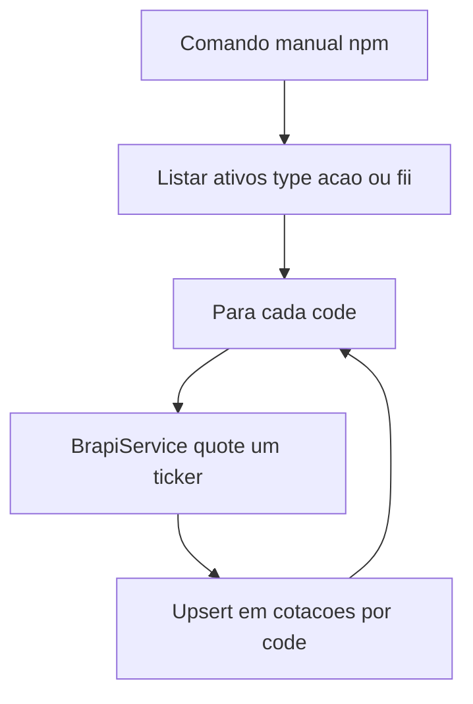

# Especificação: tabela `cotacoes` e job de atualização de cotações

Fonte: [`dev/telas/cotacao-ativos.txt`](../../telas/cotacao-ativos.txt).

## Objetivo

Persistir a cotação mais recente por ativo (ação e FII) na tabela `cotacoes` do Supabase e permitir atualização em lote disparada manualmente pela linha de comando.

## 1. Script SQL — tabela `cotacoes`

Criar ficheiro sugerido: `db/supabase/create_table_cotacoes.sql` (executar uma vez no SQL Editor do Supabase).

### Campos

| Campo         | Tipo            | Regras |
|---------------|-----------------|--------|
| `id`          | identidade      | auto incremento (Postgres: `BIGINT GENERATED ALWAYS AS IDENTITY`), `PRIMARY KEY`, `NOT NULL` |
| `code`        | `VARCHAR(20)`   | `NOT NULL`, `UNIQUE` — um registo por ticker |
| `date_update` | `DATE`          | `NOT NULL` — data da cotação utilizada |
| `value`       | `NUMERIC(15,6)` | `NOT NULL` |

### Índices

- Em `code` (performance em buscas; o `UNIQUE` já indexa `code`).
- Em `date_update` (filtros/ordenação por data).

Alinhar ao padrão das outras tabelas do projeto (`ativos`, `aportes`): comentários em PT-BR, `IF NOT EXISTS` onde fizer sentido, RLS conforme política do projeto (ex.: desativado para uso só via backend com `service_role`).

## 2. Job manual (“cron” via terminal)

- **Não** é obrigatório agendar no SO ou no Vercel na primeira versão: basta um comando reproduzível (ex.: `npm run sync-cotacoes` ou `npx tsx scripts/...`).
- A job deve:
  1. Consultar a tabela `ativos` e filtrar apenas tipos **ação** e **FII**.
  2. Para **cada** ativo, chamar a API Brapi **uma de cada vez** (sequencial).
  3. Gravar em `cotacoes`:
     - se já existir linha com o mesmo `code`: `UPDATE` de `value` e `date_update`;
     - caso contrário: `INSERT`.

### Alinhamento com o projeto (`type` na tabela `ativos`)

Na especificação original aparecem os rótulos “fiis” e “acoes”. No código e no schema atual, os valores guardados em `ativos.type` são:

- `acao` — ação  
- `fii` — FII  

A job deve usar `type IN ('acao', 'fii')`. Tipos `stock` e `reit` **não** entram nesta job (Brapi apenas para FII e ação, conforme requisito).

## 3. Biblioteca Brapi (JavaScript / TypeScript)

- Verificar se o pacote oficial está instalado; se não, instalar com:
  ```bash
  npm install brapi
  ```
- Documentação SDK TypeScript: [https://brapi.dev/docs/sdks/typescript](https://brapi.dev/docs/sdks/typescript)

## 4. BrapiService

- Criar um serviço central (ex.: `BrapiService`) com **todas** as operações que falem com a API Brapi.
- Qualquer outro ponto do projeto que hoje use Brapi diretamente (por exemplo `GET /api/quote`) deve passar a usar esse serviço.
- Token: `BRAPI_TOKEN` em `.env.local`, apenas no servidor (já é convenção do projeto).

## 5. Ambiente e segurança

- Escrita em `cotacoes`: usar o mesmo padrão das outras rotas — cliente Supabase com **`getSupabaseServer()`** e `SUPABASE_SERVICE_ROLE_KEY` (nunca expor ao browser).
- Não commitar segredos; seguir [`.env.example`](../../../.env.example) e regras em `.cursor/rules/project-conventions.mdc`.

## 6. Resumo do fluxo



## 7. Tipos TypeScript (implementação futura)

Recomenda-se definir interface `Cotacao` (ou equivalente) em `src/types/` para uso na API e no script da job.
