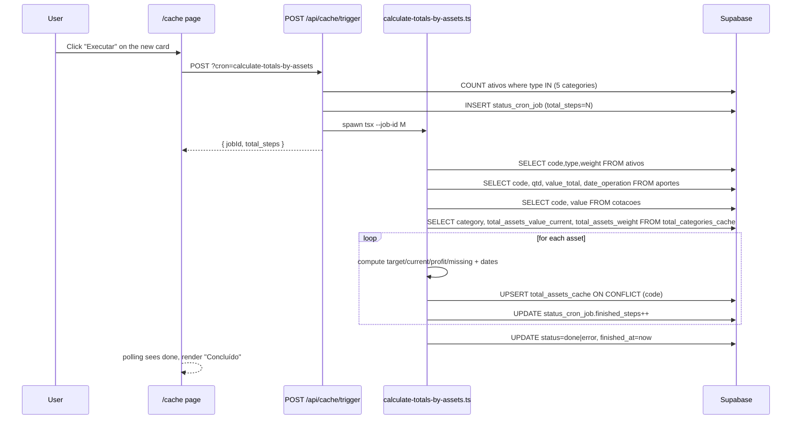

# Plan: Cron "Calculate Totals by Asset"

## Goal

Create a cron job that, for every asset (`code` × `type`), computes the aggregated metrics (target/current amount, contribution, profit, missing amount, first/last contribution date) and persists them in a new `total_assets_cache` table. Wire the job to the existing "Cache Conteúdo" page as a new trigger card. The job depends on `total_categories_cache` being already populated (by the existing `calculate-totals-by-category` cron) to compute percentages and target amounts.

---

## Files

| Action     | File                                                       |
|------------|------------------------------------------------------------|
| **CREATE** | `db/supabase/create_table_total_assets_cache.sql`          |
| **CREATE** | `scripts/calculate-totals-by-assets.ts`                    |
| **MODIFY** | `src/app/api/cache/trigger/route.ts`                       |
| **MODIFY** | `src/app/cache/page.tsx`                                   |
| **MODIFY** | `package.json`                                             |

---

## 1. SQL: `db/supabase/create_table_total_assets_cache.sql`

One row per `code`, upserted on `code` conflict. Follows the same conventions as `create_table_total_categories_cache.sql`.

```sql
-- Create the total_assets_cache table in Supabase
-- Execute this script once in the Supabase SQL editor
-- Stores per-asset aggregated metrics (target, current, profit, missing, contribution dates)

CREATE TABLE IF NOT EXISTS total_assets_cache (
    id                          BIGINT GENERATED ALWAYS AS IDENTITY PRIMARY KEY,
    code                        VARCHAR(50)    NOT NULL,
    category_name               VARCHAR(20)    NOT NULL,
    percentual_objetivo         NUMERIC(10, 2) NOT NULL,
    montante_objetivo           NUMERIC(15, 6) NOT NULL,
    total_qtd                   NUMERIC(15, 6) NOT NULL,
    cotacao                     NUMERIC(15, 6) NOT NULL,
    total_aportado              NUMERIC(15, 6) NOT NULL,
    percentual_aportado         NUMERIC(10, 2) NOT NULL,
    montante_atual              NUMERIC(15, 6) NOT NULL,
    percentual_montante_atual   NUMERIC(10, 2) NOT NULL,
    lucro                       NUMERIC(15, 6) NOT NULL,
    percentual_lucro            NUMERIC(10, 2) NOT NULL,
    montante_falta              NUMERIC(15, 6) NOT NULL,
    percentual_falta            NUMERIC(10, 2) NOT NULL,
    primeiro_aporte             DATE,
    ultimo_aporte               DATE,
    updated_at                  TIMESTAMPTZ    NOT NULL DEFAULT now(),
    CONSTRAINT total_assets_cache_code_unique UNIQUE (code)
);

CREATE INDEX IF NOT EXISTS idx_total_assets_cache_code ON total_assets_cache (code);
CREATE INDEX IF NOT EXISTS idx_total_assets_cache_category ON total_assets_cache (category_name);

ALTER TABLE total_assets_cache DISABLE ROW LEVEL SECURITY;
```

Notes:
- `category_name` is a denormalized copy of `ativos.type` for fast grouping/filtering.
- `primeiro_aporte` and `ultimo_aporte` are nullable: an asset may exist with no `aportes` rows yet.
- `BIGINT GENERATED ALWAYS AS IDENTITY` matches the convention of every other table in `db/supabase/`.

---

## 2. Script: `scripts/calculate-totals-by-assets.ts`

Mirrors the structure of `scripts/calculate-totals-by-category.ts`: imports `env.ts`, uses `getSupabaseServer()` and `job-progress.ts` helpers, returns `{ total, ok, fail }` from `main()`.

### 2.1 Inputs and outputs

- Reads: `ativos` (all rows), `aportes` (aggregated per code), `cotacoes` (per code), `total_categories_cache` (per category_name).
- Writes: upserts into `total_assets_cache` keyed by `code`.
- Tracks progress with `updateJobProgress` after each asset.
- Finishes with `finishJob(supabase, jobId, fail > 0 ? "error" : "done")` (or skips if `jobId === null`).

### 2.2 Batch-load strategy (one query per source, not N+1)

To keep the loop cheap even for large asset lists, perform **four pre-load queries** before the per-asset loop:

1. `SELECT code, type, weight FROM ativos` → `ativosList`
2. `SELECT code, qtd, value_total, date_operation FROM aportes` → aggregated client-side into `aportesByCode: Map<string, AporteAgg>`
3. `SELECT code, value FROM cotacoes` → `cotacoesByCode: Map<string, number>`
4. `SELECT category, total_assets_value_current, total_assets_weight FROM total_categories_cache` → `catTotalsByName: Map<string, CatTotals>`

If `ativosList` is empty, log a message and finish with `done` and `return { total: 0, ok: 0, fail: 0 }`.

### 2.3 Per-asset computation (inside the loop)

For each `ativo` (read `code`, `type` as `category_name`, `weight` as `peso`):

```
categoryTotals     = catTotalsByName.get(category_name) ?? { 0, 0 }
total_peso         = categoryTotals.total_assets_weight
total_value_curr   = categoryTotals.total_assets_value_current
aportes            = aportesByCode.get(code)        ?? { total_qtd: 0, total_aportado: 0, primeiro_aporte: null, ultimo_aporte: null }
cotacao            = cotacoesByCode.get(code)       ?? 0
total_qtd          = aportes.total_qtd
total_aportado     = aportes.total_aportado
montante_atual     = total_qtd * cotacao
percentual_objetivo          = peso > 0 ? total_peso / peso : 0
montante_objetivo            = total_value_curr * percentual_objetivo
percentual_aportado          = total_value_curr > 0 ? (total_aportado   / total_value_curr) * 100 : 0
percentual_montante_atual    = total_value_curr > 0 ? (montante_atual   / total_value_curr) * 100 : 0
lucro                        = montante_atual - total_aportado
percentual_lucro             = total_aportado > 0  ? (lucro            / total_aportado)  * 100 : 0
montante_falta               = montante_objetivo - montante_atual
percentual_falta             = montante_objetivo > 0 ? (montante_falta / montante_objetivo) * 100 : 0
```

Formulas (per spec lines 27–42):
- `percentual_objetivo` = `total_assets_weight` (of the asset's category) / `ativos.weight`
- `montante_objetivo`   = `total_assets_value_current` (of the category) × `percentual_objetivo`
- `total_qtd`           = `SUM(aportes.qtd)` for this `code`
- `cotacao`             = `cotacoes.value` for this `code`
- `total_aportado`      = `SUM(aportes.value_total)` for this `code`
- `montante_atual`      = `total_qtd × cotacao`
- `percentual_aportado` = `total_aportado / total_assets_value_current` (of the category) × 100
- `percentual_montante_atual` = `montante_atual / total_assets_value_current` (of the category) × 100
- `lucro`               = `montante_atual − total_aportado`
- `percentual_lucro`    = `lucro / total_aportado` × 100
- `montante_falta`      = `montante_objetivo − montante_atual`
- `percentual_falta`    = `montante_falta / montante_objetivo` × 100
- `primeiro_aporte`     = `MIN(aportes.date_operation)` for this `code`
- `ultimo_aporte`       = `MAX(aportes.date_operation)` for this `code`

All percentages stored as `NUMERIC(10,2)` → values computed in JS as a *100 number, e.g. `52.34` (not `0.5234`).

### 2.4 Upsert into `total_assets_cache`

```ts
const { error: upsertError } = await supabase
  .from("total_assets_cache")
  .upsert(
    {
      code,
      category_name,
      percentual_objetivo,
      montante_objetivo,
      total_qtd,
      cotacao,
      total_aportado,
      percentual_aportado,
      montante_atual,
      percentual_montante_atual,
      lucro,
      percentual_lucro,
      montante_falta,
      percentual_falta,
      primeiro_aporte: ap.primeiro_aporte,
      ultimo_aporte: ap.ultimo_aporte,
      updated_at: new Date().toISOString(),
    },
    { onConflict: "code" }
  );
```

If `upsertError` → log it, `fail++`, `updateJobProgress`. Otherwise `ok++`, log a summary line, `updateJobProgress`.

### 2.5 Edge cases & behavior

- **Missing `total_categories_cache` row for the asset's category** → use `{ total_assets_weight: 0, total_assets_value_current: 0 }` for that asset. All percentages and `montante_objetivo` become 0. Print a single warning at start of `main` if the cache table is empty (signals user should run `calculate-totals-by-category` first).
- **`ativos.weight === 0`** → `percentual_objetivo = 0` (guard against div-by-zero). `montante_objetivo` becomes 0, `montante_falta = -montante_atual`, `percentual_falta` becomes 0 (guard div-by-zero).
- **Asset with no `aportes`** → `total_qtd = 0`, `total_aportado = 0`, both date fields `null`, `lucro = -total_aportado = 0`, `percentual_lucro = 0`.
- **Asset with no `cotacao`** → `cotacao = 0`, `montante_atual = 0`.
- **`total_value_curr === 0`** → both `percentual_aportado` and `percentual_montante_atual` are 0.
- **`total_aportado === 0`** → `percentual_lucro = 0` (avoid `0/0`).
- A single failing asset does **not** abort the loop: `try/catch` around the per-asset block increments `fail` and continues.

### 2.6 Logging

- Start: `Calculating totals for N asset(s)...`
- Per asset: `[CODE] OK — qtd=10 cot=32.50 atual=325.00 objetivo=500.00`
- End: `Done: X ok, Y fail(s).`
- Same style as `calculate-totals-by-category.ts`.

---

## 3. Trigger route: `src/app/api/cache/trigger/route.ts`

Two minimal changes, no new file:

### 3.1 Add to the `CronName` union

```ts
type CronName =
	| 'sync-cotacoes'
	| 'sync-cotacoes-us'
	| 'sync-cotacoes-td'
	| 'sync-cotacoes-indices'
	| 'calculate-totals-by-category'
	| 'calculate-totals-by-assets';
```

### 3.2 Add entry to `CRON_CONFIG`

```ts
'calculate-totals-by-assets': {
    script: 'scripts/calculate-totals-by-assets.ts',
    types: ['acao', 'fii', 'stock', 'reit', 'td'],
},
```

`fixedTotalSteps` is **not** set: the route's existing count branch (lines 70–86) sums `ativos` filtered by the five types, which equals the iteration length in the script.

---

## 4. UI: `src/app/cache/page.tsx`

Add a new entry to the `CRON_CARDS` array:

```ts
{
    cron: 'calculate-totals-by-assets',
    label: 'Calcular Totais por Ativo',
    description:
        'Calcula montante objetivo, aporte, lucro, montante faltante e datas do primeiro/último aporte para cada ativo, gravando em total_assets_cache.',
    types: ['acao', 'fii', 'stock', 'reit', 'td'],
    source: 'Supabase (agregação)',
},
```

No other changes — the existing `CronCardComponent` polls/triggers any cron name in the array.

---

## 5. `package.json`

Add script entry (parity with `calculate-totals-by-category`):

```json
"calculate-totals-by-assets": "tsx scripts/calculate-totals-by-assets.ts"
```

---

## Data flow



---

## Notes / dependencies

- **Run order**: `calculate-totals-by-category` must run at least once before `calculate-totals-by-assets` to produce meaningful `total_assets_value_current`, `total_assets_weight`, and consequently all percentages + `montante_objetivo`. If the category cache is empty, the script logs a warning and persists zeros. The plan does not auto-chain them; this is the user's responsibility (matches the existing card pattern in `/cache`).
- **No new types** in `src/types/` are required — the cache is server-side only. If a future UI consumes `total_assets_cache`, add an `AssetTotal` type at that time (YAGNI for now).
- **No new env vars** — uses existing `SUPABASE_URL` and `SUPABASE_SERVICE_ROLE_KEY` via `getSupabaseServer()`.
- **CLI compatibility**: `npm run calculate-totals-by-assets` runs without `--job-id`; the script's progress tracking silently no-ops in that mode (same behavior as `calculate-totals-by-category`).
- **Idempotency**: upsert on `code` means re-running the cron just refreshes the rows.

---

## Etapa 2 — Total de Dividendos em `total_assets_cache`

> Aplicada em 31/07/2026.

### Objetivo
Calcular e gravar `total_dividends` em `total_assets_cache`, **excluindo** ativos da categoria `td` (Tesouro Direto não paga dividendos).

### Mudanças em `scripts/calculate-totals-by-assets.ts`

1. **Type alias** `DividendRow = { code: string; total_liquid: number }` (linha 19).
2. **5ª query no `Promise.all`** inicial (linha 25-33): `supabase.from("dividendos").select("code, total_liquid")`. Erro é tratado junto aos demais preloads (`process.exit(1)` em linha 35-52).
3. **Agregação por código** (linha 111-115): `dividendosByCode: Map<string, number>` montado em JS — soma `total_liquid` por `code`. Reproduz `SUM(dividendos.total_liquid)` do SQL.
4. **Lookup por ativo no loop** (linha 144-145):
   ```ts
   const total_dividends =
     ativo.type === "td" ? 0 : dividendosByCode.get(code) ?? 0;
   ```
   Ativos `td` recebem `0` sem consultar o Map.
5. **`total_dividends` incluído no `upsert`** (linha 184) em `total_assets_cache`.
6. **Log de sucesso** por ativo (linha 195-199) passou a incluir `dividendos=<valor>`.

### Equivalência SQL

Spec: `total_assets_cache.total_dividends = SUM(dividendos.total_liquid) INNER JOIN ativos ON dividendos.code = ativos.code AND ativos.type <> "td"`.

O preload único de `dividendos` + agregação por `code` em Map + lookup no loop (com curto-circuito para `type === "td"`) reproduz exatamente essa semântica, mantendo o padrão de batch-load já usado pelo script (5 preloads paralelos no `Promise.all`, sem N+1).

### Edge cases

| Cenário | Comportamento |
|---|---|
| `ativo.type === "td"` | `total_dividends = 0` (curto-circuito em Tarefa 4, sem lookup) |
| Ativo em outra categoria, sem dividendos | `total_dividends = 0` (`Map.get` → `undefined` → `0`) |
| `dividendos.total_liquid` `NULL` | `Number(null ?? 0) = 0` no somatório do preload |
| Múltiplas linhas para o mesmo `code` em `dividendos` | Somadas no Map (Tarefa 3) — equivale ao `SUM()` do SQL |
| Falha no preload de `dividendos` | `process.exit(1)` antes do loop (consistente com demais preloads) |

### Verificação

1. **Lint**: `npm run lint`
2. **Execução local**: `npm run calculate-totals-by-assets` — acompanhar logs (agora com `dividendos=<valor>` por ativo; para ativos `td`, deve ser `dividendos=0`).
3. **Conferência cruzada no SQL do Supabase**:

```sql
-- Esperado para ativos não-td:
SELECT a.code, COALESCE(SUM(d.total_liquid), 0) AS esperado
FROM ativos a
LEFT JOIN dividendos d ON d.code = a.code
WHERE a.type <> 'td'
GROUP BY a.code
ORDER BY a.code;

-- Cache gravado:
SELECT code, total_dividends
FROM total_assets_cache
WHERE category_name <> 'td'
ORDER BY code;
```

Os valores têm que coincidir (tolerância `<= 0.01`, consistente com `NUMERIC(15,2)`).
4. **Conferência para `td`**:

```sql
SELECT code, total_dividends FROM total_assets_cache WHERE category_name = 'td';
-- Esperado: todos com total_dividends = 0
```

---

## Etapa 3 — Conversão USD→BRL (stock/reit) + Dividend Yield

> Aplicada em 05/08/2026.

### Objetivo

Para ativos `stock` e `reit`, os dividendos armazenados em `dividendos.total_liquid` estão em **USD** (originados de fontes de mercado americanas). O `cotacoes.value` para esses tickers também está em **USD** (Twelve Data, populado por `scripts/sync-cotacoes-us.ts:89`). Já `acao` e `fii` operam em **BRL** (brapi).

A Etapa 3 faz duas coisas em `scripts/calculate-totals-by-assets.ts`:

1. **Normaliza `total_dividends` para BRL**: para `stock`/`reit`, divide o somatório de `dividendos.total_liquid` (USD) por `cotacoes.value` onde `code = 'USD_BRL'` (populado por `scripts/sync-cotacoes-indices.ts:36-40`). Resultado gravado em `total_assets_cache.total_dividends` em BRL.
2. **Calcula `dividend_yield` por ativo**: `total_dividends / montante_atual * 100`, gravado em `total_assets_cache.dividend_yield`.

`td` permanece com `total_dividends = 0` e `dividend_yield = 0` (curto-circuito mantido da Etapa 2).

### Mudanças em `scripts/calculate-totals-by-assets.ts`

#### 1. Leitura de `usdBrl` (após montar `dividendosByCode`, ~linha 117)

```ts
const usdBrl = cotacoesByCode.get("USD_BRL") ?? 0;
if (usdBrl <= 0) {
  console.warn(
    "[calculate-totals-by-assets] cotacoes.value para USD_BRL não encontrada " +
      "(execute `npm run sync-cotacoes-indices` antes). Ativos stock/reit " +
      "poderão ter total_dividends incorreto (mantido em USD)."
  );
}
```

Reaproveita o `cotacoesByCode` já construído na 2ª preload (linha 54-57) — **nenhuma query extra** ao banco. Quando `usdBrl <= 0`, exibe warning único no início e **não divide** (mantém o valor USD gravado em `total_dividends` para stock/reit, evitando perda de dados; o operador fica ciente via warning).

#### 2. Conversão USD→BRL no loop (substitui linhas 144-145)

```ts
let total_dividends =
  ativo.type === "td" ? 0 : dividendosByCode.get(code) ?? 0;

if ((ativo.type === "stock" || ativo.type === "reit") && usdBrl > 0) {
  total_dividends = total_dividends / usdBrl;
}
```

`let` (em vez de `const`) porque há reatribuição condicional. `td` zera antes da verificação; `acao`/`fii` ficam intactos (BRL).

#### 3. Cálculo de `dividend_yield` (após `montante_atual`)

```ts
const dividend_yield =
  montante_atual > 0 ? (total_dividends / montante_atual) * 100 : 0;
```

Guard `montante_atual > 0` evita divisão por zero quando o ativo não tem cotação ou não tem qtd.

#### 4. Payload do `upsert`

Acrescentar `dividend_yield` ao objeto existente (junto com `total_dividends`):

```ts
{
  ...,
  total_dividends,
  dividend_yield,
  updated_at: new Date().toISOString(),
}
```

#### 5. Log de sucesso

```ts
console.log(
  `[${code}] OK — qtd=${total_qtd} cot=${cotacao} ` +
    `atual=${montante_atual} objetivo=${montante_objetivo} ` +
    `dividendos=${total_dividends} yield=${dividend_yield.toFixed(2)}%`
);
```

### Tabela de comportamento por categoria

| `ativo.type` | `total_dividends` (gravado) | `dividend_yield` (gravado) |
|---|---|---|
| `td` | `0` (curto-circuito) | `0` (pois `total_dividends = 0`) |
| `acao` | `SUM(dividendos.total_liquid)` em BRL | `(BRL_div / BRL_montante) * 100` |
| `fii` | `SUM(dividendos.total_liquid)` em BRL | `(BRL_div / BRL_montante) * 100` |
| `stock` | `USD_sum / USD_BRL` (em BRL) | `(BRL_div / USD_montante) * 100` ⚠ |
| `reit` | `USD_sum / USD_BRL` (em BRL) | `(BRL_div / USD_montante) * 100` ⚠ |

> ⚠ **Decisão de produto**: para `stock`/`reit`, o `dividend_yield` mistura moedas (numerador BRL após Etapa 1, denominador USD), produzindo um % inflado pelo câmbio (≈×5). A fórmula é aplicada **literalmente** conforme spec. A UI identifica visualmente a moeda de cada ativo. O banco mantém a mistura como registrado.

### Edge cases

| Cenário | Comportamento |
|---|---|
| `ativo.type === "td"` | `total_dividends = 0`, `dividend_yield = 0` (curto-circuito em Tarefa 2) |
| `ativo.type === "acao"` ou `"fii"` | `total_dividends` em BRL; `dividend_yield` calculado normalmente |
| `ativo.type === "stock"` ou `"reit"` com `usdBrl > 0` | `total_dividends` convertido para BRL; `dividend_yield` calculado |
| `ativo.type === "stock"` ou `"reit"` com `usdBrl <= 0` | Warning único no início; `total_dividends` mantido em USD (sem divisão); `dividend_yield` calculado com o valor USD |
| Ativo sem `dividendos` | `total_dividends = 0`, `dividend_yield = 0` |
| `montante_atual === 0` | `dividend_yield = 0` (guard div-by-zero) |
| `dividendos.total_liquid` `NULL` | `Number(null ?? 0) = 0` no somatório do preload |
| Múltiplas linhas de `dividendos` para o mesmo `code` | Somadas no `dividendosByCode` Map (equivale a `SUM`) |
| Falha no preload de `cotacoes` | `process.exit(1)` antes do loop (consistente com demais preloads) |

### Verificação

1. **Lint**: `npm run lint` — sem novos warnings/errors em `scripts/calculate-totals-by-assets.ts`.
2. **Execução local**: `npm run calculate-totals-by-assets` — observar logs incluindo `dividendos=<v>` e `yield=<v>%`. Para `td`, esperar `dividendos=0 yield=0.00%`. Para `stock`/`reit` com `usdBrl` carregado, esperar `dividendos` em BRL (≈ valor USD / cotação do dia).
3. **Conferência cruzada no SQL do Supabase**:

```sql
-- 1. td sempre zerado
SELECT code, total_dividends, dividend_yield
FROM total_assets_cache
WHERE category_name = 'td';
-- Esperado: total_dividends = 0, dividend_yield = 0

-- 2. BR (acao/fii): dividendos + yield em BRL
SELECT a.code,
       (SELECT COALESCE(SUM(d.total_liquid), 0) FROM dividendos d WHERE d.code = a.code)
         AS sum_dividendos_brl,
       ta.cotacao AS cotacao_montante,
       ta.total_dividends AS gravado_div,
       ta.dividend_yield  AS gravado_yield
FROM ativos a
LEFT JOIN total_assets_cache ta ON ta.code = a.code
WHERE a.type IN ('acao', 'fii')
ORDER BY a.code;
-- Esperado: gravado_div = sum_dividendos_brl (tolerância <= 0.01)
--           gravado_yield ≈ (gravado_div / (total_qtd * cotacao)) * 100

-- 3. US (stock/reit): dividendos em BRL = sum USD / USD_BRL
SELECT a.code,
       (SELECT COALESCE(SUM(d.total_liquid), 0) FROM dividendos d WHERE d.code = a.code)
         AS sum_dividendos_usd,
       (SELECT value FROM cotacoes WHERE code = 'USD_BRL') AS usd_brl,
       ta.total_dividends AS gravado_div,
       ta.dividend_yield  AS gravado_yield
FROM ativos a
LEFT JOIN total_assets_cache ta ON ta.code = a.code
WHERE a.type IN ('stock', 'reit')
ORDER BY a.code;
-- Esperado: gravado_div ≈ sum_dividendos_usd / usd_brl (tolerância <= 0.01)
--           gravado_yield ≈ (gravado_div / (total_qtd * cotacao)) * 100 (mistura BRL/USD — conhecido)
```

### Equivalência SQL

- `total_dividends` para `acao`/`fii`: `SUM(dividendos.total_liquid) WHERE ativos.type IN ('acao','fii')` — em BRL.
- `total_dividends` para `stock`/`reit`: `SUM(dividendos.total_liquid) / (SELECT value FROM cotacoes WHERE code = 'USD_BRL') WHERE ativos.type IN ('stock','reit')` — convertido para BRL.
- `dividend_yield`: `(total_dividends / montante_atual) * 100` onde `montante_atual = total_qtd * cotacao`.

### Notas / dependências

- **Dependência operacional**: `cotacoes.value` para `USD_BRL` precisa estar populada (via `npm run sync-cotacoes-indices`) antes de rodar `calculate-totals-by-assets`. Sem isso, o warning é emitido e os dividendos de `stock`/`reit` ficam em USD (yield também afetado).
- **Schema**: as colunas `total_dividends NUMERIC(15,2) NULL` e `dividend_yield NUMERIC(15,2) NULL` já existem em `db/supabase/create_table_total_assets_cache.sql:23-24`. **Nenhuma migração SQL** necessária para esta etapa.
- **Sem novos arquivos / novos triggers / novos types**. Mudança contida em `scripts/calculate-totals-by-assets.ts`.
- **API consumer**: `src/app/api/total-assets/route.ts:33-37` já usa `.select("*")`, então `total_dividends` e `dividend_yield` retornam no payload JSON. Os types TypeScript em `src/types/total-asset.ts` ainda não declaram esses campos (a UI nem o consumer atual os tipa) — fora do escopo desta etapa (YAGNI).
- **Idempotência**: o `upsert onConflict: "code"` continua válido; basta rerodar para atualizar ambos os campos.
