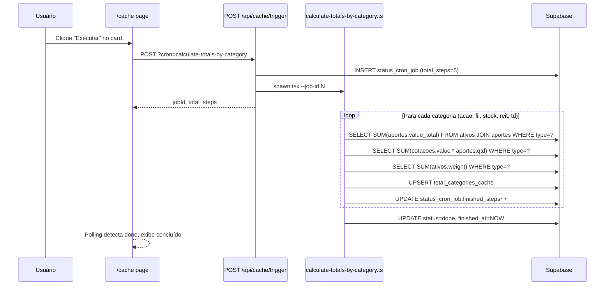

# Plano: Cron "Calcular Totais por Categoria"

## Objetivo

Criar uma cron job que calcula, para cada categoria (acao, fii, stock, reit, td), os valores totais agregados de aportes, cotações atuais e peso, salvando o resultado na tabela `total_categories_cache` (já criada no Supabase). Adicionar botão na página "Cache Conteúdo" para disparar manualmente.

---

## Arquivos envolvidos

| Ação             | Arquivo                                          |
|------------------|--------------------------------------------------|
| **CRIAR**        | `scripts/calculate-totals-by-category.ts`        |
| **MODIFICAR**    | `src/app/api/cache/trigger/route.ts`             |
| **MODIFICAR**    | `src/app/cache/page.tsx`                         |
| **MODIFICAR**    | `package.json`                                   |
| **JÁ EXISTE**    | `db/supabase/create_table_total_categories_cache.sql` |

---

## 1. Script: `scripts/calculate-totals-by-category.ts`

Segue o padrão dos scripts existentes (`sync-cotacoes.ts` etc.).

### Estrutura

```typescript
import "./env";
import { getSupabaseServer } from "../src/lib/supabase";
import { parseJobId, updateJobProgress, finishJob } from "./job-progress";
```

### Lógica

1. Conecta Supabase, lê `--job-id`
2. Busca categorias da tabela `categories` (`SELECT name FROM categories`)
3. Define `total_steps = categories.length` (5: acao, fii, stock, reit, td)
4. Para cada categoria, executa **3 queries agregadas**:

```sql
-- total_assets_value_aported: soma dos aportes dos ativos da categoria
SELECT COALESCE(SUM(a.value_total), 0)::numeric(15,6)
FROM ativos at
JOIN aportes a ON at.code = a.code
WHERE at.type = $category

-- total_assets_value_current: soma (cotação * quantidade) dos ativos da categoria
SELECT COALESCE(SUM(c.value * a.qtd), 0)::numeric(15,6)
FROM ativos at
JOIN cotacoes c ON at.code = c.code
JOIN aportes a ON at.code = a.code
WHERE at.type = $category

-- total_assets_weight: soma dos pesos dos ativos da categoria
SELECT COALESCE(SUM(at.weight), 0)::numeric(10,2)
FROM ativos at
WHERE at.type = $category
```

5. **Upsert** na `total_categories_cache` usando `category` como chave de conflito:

```sql
INSERT INTO total_categories_cache (category, total_assets_value_aported, total_assets_value_current, total_assets_weight, updated_at)
VALUES ($category, $aported, $current, $weight, NOW())
ON CONFLICT (category) DO UPDATE SET
    total_assets_value_aported = EXCLUDED.total_assets_value_aported,
    total_assets_value_current = EXCLUDED.total_assets_value_current,
    total_assets_weight = EXCLUDED.total_assets_weight,
    updated_at = NOW()
```

6. Após cada categoria processada: `await updateJobProgress(supabase, jobId, ok, fail)`
7. Ao final: `await finishJob(supabase, jobId, fail > 0 ? "error" : "done")`
8. Se `jobId === null` (execução CLI direta sem job tracking), roda normalmente sem progresso

### Tratamento de erros

- Se uma query falhar, incrementa `fail`, loga erro, continua para próxima categoria
- Se não houver categorias na tabela, finaliza com `done` e retorna early
- Valores `NULL` nas somas são tratados com `COALESCE(..., 0)`

---

## 2. Trigger route: `src/app/api/cache/trigger/route.ts`

### Adicionar `CronName`

```typescript
type CronName = 'sync-cotacoes' | 'sync-cotacoes-us' | 'sync-cotacoes-td' | 'sync-cotacoes-indices' | 'calculate-totals-by-category';
```

### Adicionar entry no `CRON_CONFIG`

```typescript
'calculate-totals-by-category': {
    script: 'scripts/calculate-totals-by-category.ts',
    fixedTotalSteps: 5, // 5 categorias fixas
},
```

### Efeito

- `POST /api/cache/trigger?cron=calculate-totals-by-category` valida, insere job row com `total_steps=5`, spawna o script

---

## 3. UI: `src/app/cache/page.tsx`

### Adicionar card no array `CRON_CARDS`

```typescript
{
    cron: 'calculate-totals-by-category',
    label: 'Calcular Totais por Categoria',
    description: 'Calcula e atualiza os totais agregados (aportes, valor atual, peso) para cada categoria de ativo.',
    types: ['acao', 'fii', 'stock', 'reit', 'td'],
    source: 'Supabase (agregação)',
},
```

### Efeito

- 5º card na grid `md:grid-cols-2` (ou 3 cards na primeira linha, 2 na segunda)
- Mesmo comportamento de polling, progresso (5 steps), botão "Executar" etc.

---

## 4. `package.json`

Adicionar script para execução direta via CLI:

```json
"calculate-totals-by-category": "tsx scripts/calculate-totals-by-category.ts"
```

---

## Fluxo de dados



---

## Notas

- A tabela `total_categories_cache` já existe no Supabase (SQL em `db/supabase/create_table_total_categories_cache.sql`)
- O cálculo usa `JOIN` direto entre `ativos`, `aportes` e `cotacoes` — sem precisar de RPC/stored procedure
- Total de steps = 5 (uma por categoria), não o número de ativos, pois o processamento é por categoria
- Tratamento de ativos sem aportes ou sem cotações: `COALESCE` garante 0 nessas categorias
- Compatível com execução direta via `npx tsx scripts/calculate-totals-by-category.ts` (sem `--job-id`)