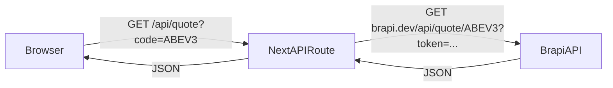

# Plano: Cotação IBOV

## Stack e Arquitetura

- **Frontend:** Next.js 15 (App Router) + TypeScript + Tailwind CSS
- **Backend:** API Routes do próprio Next.js (não é necessário servidor Node separado — o Next.js já inclui o runtime de servidor)
- **API externa:** Brapi (`https://brapi.dev/api/quote/{ticker}`)
- **Deploy:** Vercel

O token da API fica somente no servidor (API Route), nunca exposto no cliente.



## Estrutura de Arquivos

```
ibov/
├── .env.local                         ← variáveis de ambiente
├── package.json
├── next.config.ts
├── tsconfig.json
├── src/
│   ├── app/
│   │   ├── layout.tsx                 ← layout global
│   │   ├── page.tsx                   ← tela principal (formulário + resultado)
│   │   ├── globals.css
│   │   └── api/
│   │       └── quote/
│   │           └── route.ts           ← proxy seguro para a Brapi
│   └── types/
│       └── brapi.ts                   ← tipos TypeScript da resposta Brapi
└── dev/
    ├── ibov.txt
    └── plans/
        └── plan-cotacao-ibov.md
```

## Etapas de Implementação

### 1. Inicializar o projeto Next.js ✅

```bash
npx create-next-app@latest . --typescript --tailwind --eslint --app --src-dir --no-import-alias
```

### 2. Configurar variáveis de ambiente ✅

Criar `.env.local` com a variável para o padrão Next.js:

```
BRAPI_TOKEN=<chave_api>
```

> `.env.local` é ignorado pelo Git por padrão e nunca enviado ao cliente.

### 3. Criar tipos TypeScript (`src/types/brapi.ts`) ✅

Interfaces `BrapiResult` e `BrapiResponse` para tipar a resposta da Brapi.

### 4. Criar API Route (`src/app/api/quote/route.ts`) ✅

Proxy server-side para a Brapi — mantém o token seguro no servidor.

```typescript
// GET /api/quote?code=ABEV3
export async function GET(request: NextRequest) {
  const code = searchParams.get('code');
  const token = process.env.BRAPI_TOKEN;
  const res = await fetch(`https://brapi.dev/api/quote/${code}?token=${token}`);
  return NextResponse.json(await res.json(), { status: res.status });
}
```

### 5. Criar a tela principal (`src/app/page.tsx`) ✅

- Formulário com campo `name="code"`, label **"Ação/FII"** e botão **"Buscar"**
- Estado React: `loading`, `error`, `result`
- `onSubmit` chama `fetch('/api/quote?code=...')`
- Card de resultado com:
  - Nome da empresa e símbolo do ativo
  - Preço atual
  - Variação do dia (positiva em verde, negativa em vermelho)
  - Abertura, fechamento anterior, máxima, mínima do dia
  - Volume negociado
  - Intervalo de 52 semanas

### 6. Deploy na Vercel — passo a passo (etapa futura)

> A criação do repositório Git e o deploy na Vercel serão feitos em uma próxima etapa.

1. **Criar repositório Git** e publicar no GitHub (ou GitLab/Bitbucket)
2. **Conectar à Vercel:** acessar [vercel.com/new](https://vercel.com/new), importar o repositório e confirmar o framework Next.js
3. **Configurar variável de ambiente na Vercel:** `BRAPI_TOKEN` em **Settings → Environment Variables**
4. **Deploy automático:** cada `git push` na branch `main` fará deploy automático

## Dados exibidos na tela (resposta da Brapi)

A URL `https://brapi.dev/api/quote/ABEV3?token=TOKEN` retorna um JSON com `results[0]` contendo:

| Campo | Descrição |
|---|---|
| `symbol` | Código do ativo (ex: `ABEV3`) |
| `shortName` | Nome curto da empresa |
| `regularMarketPrice` | Preço atual |
| `regularMarketChange` | Variação absoluta |
| `regularMarketChangePercent` | Variação percentual |
| `regularMarketVolume` | Volume negociado |
| `regularMarketDayHigh` | Máxima do dia |
| `regularMarketDayLow` | Mínima do dia |
| `regularMarketPreviousClose` | Fechamento anterior |
| `regularMarketOpen` | Preço de abertura |
| `fiftyTwoWeekHigh` / `fiftyTwoWeekLow` | Máxima/mínima das últimas 52 semanas |
